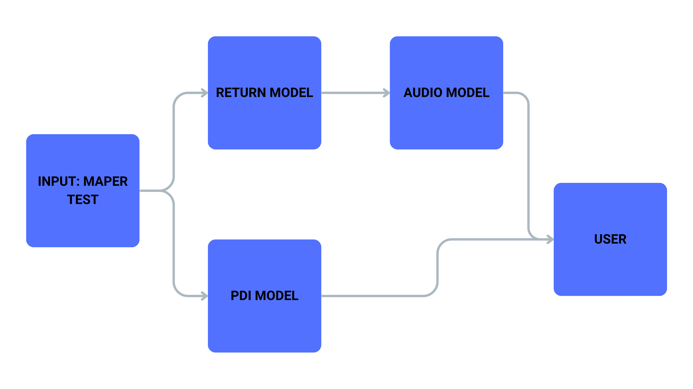

# NUVEN - IA MAPER
<p align="center">
    
</p>

Bem-vindo à documentação do projeto **IA MAPER**.

## 📚 Sobre o Repositório

Este repositório contém o código da Prova de Conceito (POC) do **IA MAPER**. Aqui você encontrará todas as informações necessárias para configurar e utilizar o projeto.

<p align="center">
    
</p>


## 🎲 Pré-Requisitos

Antes de começar, verifique se você atende aos seguintes pré-requisitos:

- Gerenciador de ambientes Conda instalado.
- CUDA Toolkit 11.8 ou superior instalado (caso o ambiente rode em GPU).
- Gerenciador de pacotes `pip` instalado.

## 💿 Instalação

Siga as etapas abaixo para configurar o ambiente de desenvolvimento:

### 1. Clone o repositório

Clone este repositório para o seu sistema local:

```bash
git clone https://github.com/nuven-iamaper/iamaper-ia.git
```

### 2. Crie um ambiente via `conda`

Crie um ambiente Python 3.10.0 com o Conda:

```bash
conda create -n IAmaper python=3.10.0
```

### 3. Instale as dependências do projeto

Ative o ambiente criado e instale as dependências:

```bash
pip install -r requirements.txt
```

### 4. Reinstale PyTorch com suporte a CUDA (opcional)

Caso o ambiente de execução tenha GPU, reinstale o Pytorch com suporte a CUDA:

```bash
pip install torch torchvision torchaudio --index-url https://download.pytorch.org/whl/cu118
```

## Estrutura do projeto

    artifacts/
        ├── audio_exemplo.wav
        ├── bloco_1_por_grupo_notas.json
        ├── bloco_2_por_grupo_notas.json
        ├── bloco_3_por_grupo_notas.json
        ├── bloco_4_por_grupo_notas.json
        ├── bloco_5_por_grupo_notas.json
        ├── bloco_6_por_grupo_notas.json
        ├── bloco_7_por_grupo_notas.json
        ├── bloco_8_por_grupo_notas.json
        ├── bloco_9_por_grupo_notas.json
        ├── bloco_10_por_grupo_notas.json
        ├── bloco_11_por_grupo_notas.json
        ├── bloco_12_por_grupo_notas.json
        ├── bloco_13_por_grupo_notas.json
        ├── bloco_14_por_grupo_notas.json
        ├── bloco_15_por_grupo_notas.json
        ├── bloco_16_por_grupo_notas.json
        ├── competencias.json
        ├── conexoes.json
        ├── copia_de_questoes.json
        ├── feedbacks.json
        ├── new_pdi_feedbacks.json
        ├── old_pdi_feedbacks.json
        ├── resultado.json
        └── saida_final.json

    assets/
        └── logo.png

    audio/
        ├── TextToSpeechProcessor.py
        └── utils.py

    docs/
        ├── DevolutivaGenerator.md
        ├── docsUtils/
        │   ├── calcular_resutado_maper.md
        │   ├── gerar_pdf_saida_pdi.md
        │   ├── global_dict.md
        │   ├── prompts.md
        │   └── save_json_file.md
        ├── Geral.md
        ├── llm_models.md
        ├── PDIGenerator.md
        └── TextToSpeechProcessor.md

    model/
        └── llm_models.py

    pipeline/
        ├── DevolutivaGenerator.py
        └── PDIGenerator.py

    utils/
        ├── calcular_resutado_maper.py
        ├── devolutive_plus_connection.py
        ├── gerar_pdf_saida_pdi.py
        ├── global_dict.py
        ├── prompts.py
        └── save_json_file.py

    main.py
    README.md
    requirements.txt
